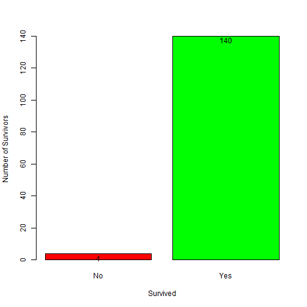
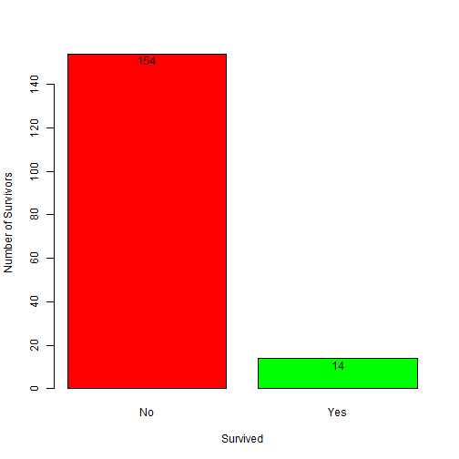

## Titanic Survivor Statistics - Shiny App
This application calculates survivor statistics based upon the Titanic
dataset. The dataset is broken apart by Class, Sex, Age, and the number
of those who survived the sinking of the ship Titanic in 1912 in those 
groups. The user can explore by selecting different combinations of 
these variables.
      


```r
head(titanic)
```

```
##   Class    Sex   Age Survived Freq
## 1   1st   Male Child       No    0
## 2   2nd   Male Child       No    0
## 3   3rd   Male Child       No   35
## 4  Crew   Male Child       No    0
## 5   1st Female Child       No    0
## 6   2nd Female Child       No    0
```

---

## Data Analysis

There are statistics on a total of 711 survivors and 1490 who did not survive the event.


```r
sum(titanic[titanic$Survived=='Yes',5])
```

```
## [1] 711
```

```r
sum(titanic[titanic$Survived=='No',5])
```

```
## [1] 1490
```

---

## Data Analysis

We can see that among all groups - Female's on the 1st Class had the highest survival rates for Adults. Below we see a 97% rate for Adult females. Children tended to have the highest percentage overall, but the amount of children on board were extremely low compared to adults.

 

---

## Data Analysis

2nd Class Males had the lowest survival rate at only 8% as shown below. 3rd and Crew class had many more deaths for males when ignoring the survival rates.

 

---

## Data Analysis Cont.

We can see this drastic loss for the male crew below. Given the large amount of crew compared with passengers, the survival rate is statistically higher for the Crew vs. the previous 2nd Class graph.

 
